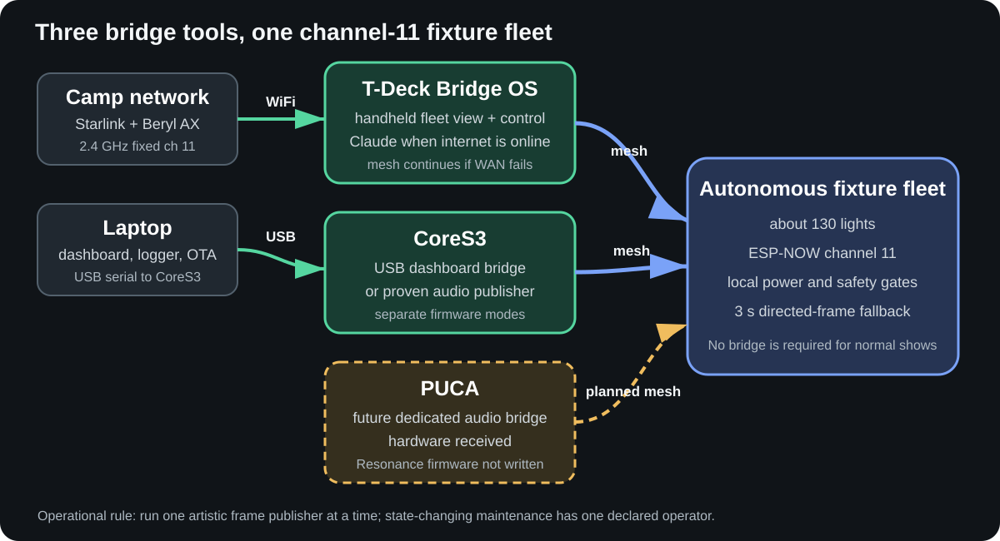
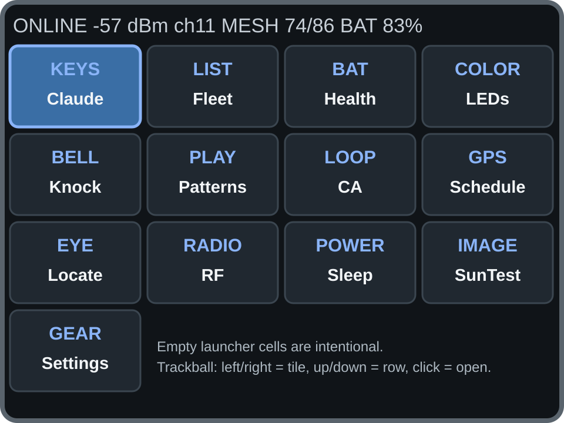

# Resonance Bridge Field Manual

## Bridge OS, CoreS3, and PUCA without the archaeology

**Living document:** 2026-08-27

**Audience:** field operators, lighting crew, IT support, and developers on call
**Scope:** the LilyGO T-Deck Plus Bridge OS, the M5Stack CoreS3 bridge, and the
PUCA performance-audio bridge

This is the friendly manual. It explains what to pick up, what the screens mean,
which button to press, what can go wrong, and when to stop and call Ben. It is not
the wire protocol, build record, or architecture decision log. Those remain linked
at the end.

The most important idea is simple:

> The lights are autonomous. A bridge can observe them or temporarily direct them,
> but no bridge is the brain of the tree. Local battery, lifecycle, and actuator
> safety always win.



*Figure 1. The three bridge roles. PUCA's powered-Pod20 development baseline
passes, but show acceptance remains open. Run one artistic frame publisher at
a time.*

## Read this first

These six rules prevent most field mistakes:

1. **The fleet is on ESP-NOW channel 11.** A T-Deck may use WiFi and the mesh at
   the same time only when the 2.4 GHz access point is also on channel 11.
2. **A callsign is friendly; the six-hex short MAC is identity.** Say and record
   both for any state-changing work: `Ponyta [F2B7DC]`, for example.
3. **Check the live count before a fleet action.** A sleeping or silent fixture
   cannot hear a best-effort broadcast. `seen` is history; `live` is reachable
   now.
4. **Dark and sleep are different.** Dark keeps the radio awake and draws much
   more power. Sleep turns off the rails and radio and cannot be cancelled over
   the air until the timer wakes the fixture.
5. **Leaving LEDs or Patterns does not stop the look.** Use the app's **Stop**
   button. A lost direct stream falls back to autonomous output in about three
   seconds.
6. **Use one live artistic publisher at a time.** T-Deck LEDs, T-Deck Patterns,
   CoreS3 audio, and PUCA audio all use directed frames. Two publishers
   can visibly fight because artistic control is intentionally last-writer-wins.

> **Security note:** fleet commands are not yet authenticated on the radio. Keep
> the T-Deck in trusted hands. Physical possession is an operating mitigation,
> not a cryptographic security property.

For OTA, USB flashing, reboot, profile/channel persistence, or any other NVS
mutation, use one declared operator across all bridges and laptops. Follow
[Firmware artifact identity and shared-bench handoff](FIRMWARE_ARTIFACT_HANDOFF.md).

## Which bridge should I use?

| Need | Use | Why |
|---|---|---|
| Walk the site, check health, identify a light, or set a temporary look | **T-Deck Bridge OS** | Handheld, mesh-native, works without a laptop; Claude is optional |
| Check nearby fleet health without a laptop | **CoreS3 Listener** | Touch-first, paged wireless health view with fixture detail |
| See the complete host dashboard or record serial telemetry | **CoreS3 Bridge OS + laptop** | The same image retains the proven USB dashboard and logger protocol |
| Run audio-reactive lights today | **CoreS3 + Module Audio + RODE** | Broadband response is hardware-validated; FFT/band modes are the current experiment |
| Use Cambium's binary serial transport | **CoreS3 Cambium build** | Separate firmware mode; not compatible with the text dashboard |
| Run the dedicated performance audio box | **PUCA, after show acceptance** | `0.5` safe boot/exact-target OTA passes; exact waveform, visible fixture response/fallback, rollback, and field geometry remain open |
| Run the ordinary autonomous show | **No bridge required** | The fixture fleet is designed to keep working without infrastructure |
| Update fixture firmware | **Laptop + shared-WiFi OTA tools** | A bridge can request exact-target maintenance, but it is not the OTA uploader |

## Status at a glance

The words below are deliberately conservative:

- **Working** means hardware evidence exists for the main path.
- **Canary** means the feature is in the flashed image, but its explicit field
  acceptance matrix is still open.
- **Planned** means do not expect a working feature.

| Device or feature | Status on 2026-08-27 | Practical meaning |
|---|---|---|
| T-Deck mesh, launcher, touch, trackball, keyboard, GPS, channel guard | Working | Hardware-probed on T-Deck `8EB508` |
| T-Deck Claude, Fleet, LED Studio, Blackout / Sleep, single Knock, CA Studio | Working with limits | Broad hardware or field smoke tests passed; read the app notes below |
| Contagion | Source-built, not field accepted | Color Virus/Epidemic; keep knock output off until named-canary qualification |
| T-Deck Health and Schedule | Canary | Broad physical smoke passed; full color/off-air/override matrices remain open |
| T-Deck callsigns, Patterns v1, RF Diagnostics, full-fleet Knock roll | Canary | Current image is flashed; deliberate named-canary checks remain open |
| T-Deck Default selector and RGB white mapping | Source-built | Native and embedded builds pass; not flashed or hardware-validated |
| T-Deck Locate, detailed sensor samples, microphone Patterns, voice | Planned | Locate is a visible placeholder; the others have no finished operator path |
| CoreS3 Listener + Audio Bridge OS | Working baseline; spectral canary | Standalone speech/envelope response is fleet-proven; 25 Hz spectrogram and band modes need hardware acceptance |
| PUCA Resonance bridge | `0.5` safe boot/OTA passed; show acceptance pending | Codec/stereo capture, radio census, no-hold safe boot, Bridge identity, and exact-target OTA are proven; armed controls, waveform/light, rollback, and field gates remain open |

The current T-Deck unit is short ID `8EB508`, full MAC
`44:1B:F6:8E:B5:08`. The callsign-aware binary recorded on 2026-08-24 is
1,550,224 bytes with SHA-256
`3026593615bd58304c2a6b8893bf4f92cd8f9f92211f9222a5a28517fedf6e32`.
A COM port is an observation, not identity; `COM152` was the observed port at
that flash, not a permanent name.

# Part I: T-Deck Bridge OS

## The one-minute startup

1. Power the T-Deck and wait for the launcher.
2. Read the top line. Confirm `ch11`, confirm the mesh live/seen count is
   plausible, and note whether the left side says online, mesh-only, connecting,
   or guard.
3. Open **Health**. A mostly grey screen immediately after boot can be normal;
   give sleeping fixtures time to report.
4. If you will command a fixture, name the intended callsign and short ID before
   touching the control.
5. If you need Claude, confirm WiFi is online. Every mesh app still works if
   internet is down.

If the launcher says `GUARD`, do not change the fleet channel. Fix the 2.4 GHz
access point so it is on channel 11, then use serial `wifi retry`.

## Screen and controls

The T-Deck has three useful input methods:

- **Touch:** fastest with bare hands.
- **Trackball:** the reliable playa choice with gloves, dust, or a fussy touch
  screen. Left/right changes focus, up/down uses the current screen's navigation,
  and click opens or activates the focused item.
- **Keyboard:** primarily for Claude chat. Enter submits.

On the launcher, left/right moves one tile and up/down jumps one four-tile row.
The blue tile is focused. Most app screens put **Back** at the bottom.



*Figure 2. Source-derived launcher map at three times the device's 320 x 240
resolution. It is a faithful screen guide, not a camera photograph.*

In direct sun, remove the shipped protective film and tilt the screen so sunlight
does not hit it square-on. The panel was judged fairly clear that way. Use the
trackball if touch becomes unreliable. T-Deck battery runtime with the census and
screen active is still unmeasured, so begin critical work charged and carry USB-C
power.

## Reading the top status line

The launcher compresses five facts into one line:

```text
network   WiFi signal   mesh channel   live/seen fixtures   T-Deck battery
ONLINE      -57 dBm         ch11              74/86               83%
```

| Display | Meaning | What to do |
|---|---|---|
| `ONLINE` or WiFi symbol | WiFi is associated on the correct channel; mesh and internet can coexist | Claude should work after time sync |
| `mesh` or mesh-only | No infrastructure WiFi, but ESP-NOW is active | Normal for field control without Claude |
| connecting/refresh | WiFi join is in progress | Wait up to about 15 seconds; mesh returns on timeout |
| `GUARD` | The AP channel does not match the stored mesh channel | Fix the AP to channel 11, then retry WiFi |
| `ch11` | The stored mesh channel | This is the production value |
| `74/86` | 74 live now, 86 seen since boot | Only the 74 live fixtures are plausible immediate recipients |

## Safe control hierarchy

When two instructions disagree, the fixture follows this order:

```text
local safety and battery veto
  -> transport-dark or active dark lease
    -> active direct color or program lease
      -> temporary Wake Fleet / Night Show baseline
        -> UTC civil-twilight schedule
          -> panel-current fallback
```

This explains several apparently surprising results:

- **Night Show** cannot defeat low-battery shutdown.
- **LED Studio** can deliberately light a healthy fixture during scheduled day.
- **Blackout** can suppress a scheduled night show.
- A deliberate operator strike request is attempted without time, solar, or
  battery-tier qualification, but can still produce no motion when the fixture
  is asleep, disarmed, in maintenance, inside rest time, lacks hardware, or the
  hard mechanism gate refuses it.

## Health: start here

Use **Health** for the fastest whole-fleet triage. It fits the production-health
registry on one screen and appends unexpected live IDs. The top-right button
switches the stable tiles between raw battery-voltage (`VBAT`) and charger-phase
(`CHG`) colors.

| Tile | Meaning |
|---|---|
| Green | fresh raw VBAT is above 3.20 V |
| Yellow | fresh raw VBAT is above 3.10 V and at or below 3.20 V |
| Red | fresh raw VBAT is at or below 3.10 V |
| Grey | rostered fixture is not fresh/on-air |
| Blue | fixture is live, but its battery value is not plausible |
| Cyan border | live ID is outside the normal production-health roster |

In CHG mode, green means `CHARGING_CC`, cyan `CHARGING_CV`, purple `TOP_OFF`,
amber `NOT_CHARGING/DONE`, brown `CHARGE_DISABLED`, red charger fault, blue
unknown, and grey off air. These phases come from the BQ25628E status/fault
registers. They are not guesses from a small signed-current number.

These colors are triage bands, not the fixture's complete ADR 0023 power-state
machine. Do not force a red fixture to perform merely because it still answers.

Tap or focus-and-click a square to see callsign and short ID, VBAT, validated
signed IBAT, human charger phase, input voltage/current, age, RSSI/PDR, advisory
SOC, class, program, lifecycle, tier, sensor signature, firmware, registry
status, battery capacity, and role.

Grey means **not fresh**, not automatically broken. After bridge boot, wait at
least one normal sleep cadence before calling a field fixture missing. Older or
PROTECT firmware can require a 16-minute census before absence becomes strong
evidence.

## Fleet: filter, sort, inspect, and identify fixtures

**Fleet** is the detailed scrollable roster. It shows:

- a chip of the fixture's reported rendered color;
- callsign when known, otherwise short ID;
- class letter: `D` downlight, `P` perimeter, `U` uplight, `C` chandelier;
- age, raw battery voltage, signed battery current (`+` charge, `-` draw), and
  active program.

Signed current is shown only when the fixture explicitly certifies a settled
post-guard MAX17260 sample. `-` or `-- (unverified)` means the value cannot be
trusted, which is expected for old firmware and the first heartbeat after wake.

`inf` means this bridge has never observed the registry fixture. `idle` is a
real reported program; `?` means program state has not been observed. Sparse
full-heartbeat program state is retained across short heartbeats and discarded
on peer reboot until the new boot supplies fresh full-heartbeat state. Detail
keeps RSSI/PDR and advisory SOC, and spells out state names such as
`DAY_CHARGE`, `DIRECT`, `PROTECT`, and `CHARGING_CC` instead of showing only
numeric codes.

Open a row for details and **Identify**, which requests a ten-second green blink.
The default view includes the complete production registry plus unexpected live
peers and sorts by callsign. Registry fixtures keep grey off-air rows, so ordinary
two-second refreshes do not move the list underneath a scroll. The selected
fixture and scroll context survive refresh and a visit to detail.

Press **View** to combine:

- `roster + live`, `seen since boot`, or `live now` rows;
- all light types, downlights, perimeter, uplights, chandelier, or unknown;
- all battery states, good, near low, low, off air, or no valid VBAT;
- all programs or one of IDLE, CA, BRIDGE, DIRECT, DARK, VIRUS, and unknown;
- all/known/unknown firmware, an exact observed reference revision, or the
  complementary non-match/unknown cohort for OTA rollout audits; and
- stable callsign, stable short ID, voltage low/high, most recent, or strongest
  signal sorting.

The raw-voltage bands match Health: good is above 3.20 V, near low is above
3.10 V through 3.20 V, and low is at or below 3.10 V. `off air` is separate
from `no valid VBAT`; silence is not displayed as a zero-voltage battery.
Bridge OS defaults to full-brightness `DAY` mode for sunlight. Fleet uses light
cells with dark text in that mode. Press the top-right `DAY`/`NITE` button to
switch immediately; night mode restores the saved lower backlight and explicit
dark-table colors. The same persistent switch is available in Settings.

Press **Blink** to identify every **fresh** fixture in the current filtered view.
The device first confirms the exact count with cancel focused, then walks that
captured cohort with paced exact-target 30-second green blinks. Hidden and
off-air fixtures are not targeted or claimed as reached. **Power** opens
Blackout / Sleep; End Blackout remains available there.

These Fleet view controls are flashed on primary T-Deck `8EB508` as of
2026-08-27. Esptool write verification, an exact full application-region
readback, and post-reset channel-11 mesh/peripheral checks passed. Physical
screen layout, dropdown, stable-scroll, detail/back, 192-row memory, and named
filtered-identify canary acceptance remain open in `TODO.md`.

The compact signed-current row, IDLE-versus-unknown fix, readable detail states,
and program/firmware rollout filters documented above are now in the combined
image flashed on exact `8EB508`. Its 1,581,168-byte `tdeck-dev-local` binary has
SHA-256
`c87b2805feb8bd95c0d6c9ae3022baaa40079483bca652de6c33f738c0e69e7e`.
Upload and an independent whole-application `verify-flash` digest comparison
passed; physical layout/filter acceptance remains open in `TODO.md`.

The ADR 0064 power-truth UI is now flashed on the same exact T-Deck as a
1,583,344-byte `tdeck-dev-local` binary, SHA-256
`3bc13ca8a8bfeb60aaa31d349721b3760522dc1600f3913dd145400fe1ef905c`.
It adds validated-IBAT rendering, human charger phases, the Health VBAT/CHG
toggle, and the Wake/Blackout/Deep-sleep names. Esptool verified every written
region and post-reset serial reported live `8EB508` channel-11 traffic. Fixture
canary validation remains open.

Callsigns are display and command-entry aliases. Short MAC remains authoritative
for flashing, OTA, manifests, persistence, and incident records. Unknown peers
fall back to short ID. The special Magic Wand appears as `Thor [F40344]`; its
firmware is protected from ordinary fleet OTA by ADR 0050.

## LEDs: simple colors and blinking

Use **LEDs** to run LED Studio:

1. Select `all`, `downlights`, `perimeter`, `uplights`, or `chandelier`.
2. Touch a labeled swatch: red, amber, green, cyan, blue, purple, white, or pink.
3. Set **dim**.
4. Choose **solid** or **blink 1Hz**.
5. Watch the line saying how many fresh fixtures are receiving the stream.
6. Use **Stop** when finished.

Changing a swatch starts or updates the stream immediately. Class data arrives
in full heartbeats and can take about 60 seconds to fill after bridge boot. If a
class filter finds unexpectedly few fixtures, wait and check Fleet/Health before
assuming those lights are missing.

The **white** swatch means visible white, not blindly writing the fourth RGBW
byte. Known downlights use their dedicated white die. Perimeter, uplight, and
chandelier classes receive full red + green + blue with the white byte clear,
so three-channel RGB modules work and mixed chandelier hardware remains safe.
This mapping is source-built as of 2026-08-25 and still needs a named RGB/RGBW
physical recheck before show use.

The stream continues when you press **Back**. It stops only when you press
**Stop**, start a competing stream such as Patterns, or start a Blackout/Sleep
action.
If the stream disappears, fixtures return to autonomous behavior in about three
seconds.

## Patterns: deterministic handheld shows

Use **Patterns** for a manual, microphone-independent look:

- modes: Wash, Chase, Wave, Twinkle;
- palettes: Ember, Forest, Ocean, Aurora, Moon;
- filters: fixture class and stable cohort A-D;
- controls: speed 1-8 and intensity 8-255.

Set the controls, press **Start**, and confirm the target count. **Back** leaves
the pattern running; **Stop** ends it. Starting Patterns replaces LED Studio, and
starting LED Studio replaces Patterns. They are two faces of one stream owner.

Patterns v1 is in the current T-Deck image and its model is heavily native-tested,
but the named HEX/RGBW physical acceptance matrix remains open. Use explicit
canaries before an important show. Microphone reactivity is not part of T-Deck
Patterns yet.

## Blackout / Sleep: know the difference

The screen defaults to **Blackout** for **10 minutes**, the reversible choice.
Read the selection before applying it; deep sleep still cannot be cancelled.

| Action | LEDs | Radio | Can cancel remotely? | Best use |
|---|---|---|---|---|
| Blackout | rail off | awake | Yes, with End Blackout or lease expiry | Short reversible blackout and diagnostics |
| Deep sleep | rails off | off | No; timer wake or physical reset/power cycle | Overnight energy saving |

Available durations are 10 minutes and every whole hour from 1 through 12.
Both actions show live/seen counts and require an on-device confirmation with
cancel focused by default.

Before RF, Bridge OS durably records the action, duration, exact mesh sequence,
bridge uptime, and fresh GPS UTC when available. The newest four actions survive
a T-Deck reboot and appear under serial `show`; the newest also appears in the
host dashboard's Master panel. If that write fails, Deep sleep or Blackout is
not sent.

For Blackout, use **End Blackout** to return reachable fixtures to autonomous
behavior. That button cannot wake a sleeping fixture. For Deep sleep, watch the
live count fall after the command; only fixtures that were awake to hear it can
leave the census. At timer wake they resume normal behavior automatically.

Blackout-but-awake draw has measured roughly 126-144 mA per fixture. Rails-off
sleep is sub-mA. Blackout is not a power-saving substitute for an overnight
sleep.

## Wake: Auto, Wake Fleet, and Night Show

The **Wake** app shows the T-Deck GPS summary and whether a valid UTC fix is
available. It offers three field baselines:

- **Auto:** use UTC civil twilight at Black Rock City, with the fixture's
  bounded solar/power fallback if trustworthy time expires.
- **Wake Fleet:** repeat the dark daytime baseline for six minutes so sleeping
  fixtures receive it on timer wake. Each captured fixture then stays in its
  normal ten-minute control hold for follow-up commands.
- **Night Show:** temporarily force the nighttime baseline.

The choice is RAM-only and clears on fixture reboot. Direct colors and program
leases can override this baseline; Blackout and local safety remain above it.
Wake Fleet is not an energy-saving dark command: its purpose is to make the
fleet reachable. Use Blackout for an already-awake reversible blackout and Deep
sleep for deliberate radio-off energy saving.

Schedule is a production-direction feature with native coverage and first-canary
firmware evidence, but the full multi-fixture sleep-cycle acceptance matrix is
still open. Verify on named canaries before relying on it fleet-wide.

## Knock: request a bamboo strike

The target list contains one row per fresh fixture plus
`ROLL ALL (targeted)`. Set a pulse from 5 to 300 ms; 40 ms is the ordinary
starting point.

- A single target sends one addressed request.
- Roll All sorts every fresh ID and sends one addressed request every 80 ms.
- Roll All is **not synchronized**. The display reports sent requests, not
  guaranteed mechanical impacts.

Updated fixtures accept the Knocker broadcast event; older images ignore it.
Under ADR 0065, received Knocker targeted and multicast requests bypass night,
solar, and battery-tier qualification. Arm, rest, maintenance, pulse, durable
load-marker, deadline, and mechanism gates remain, so the UI reports attempts
rather than guaranteed impacts. The current full-fleet roll fixes an older
32-fixture limit but still awaits its explicit hardware recheck. Use a named
single fixture before using the roll.

## CA: cellular-automaton studio

**CA Studio** leases the Greenberg-Hastings wildfire to the fleet. Choose the
output that the CA excitation drives:

| UI name | Meaning |
|---|---|
| lights | excitation renders the existing light wildfire |
| knocks | excitation requests one sound-only solarnoid strike |

For CA, the sliders mean:

- `K neighbors`: excitation threshold;
- `spark /256`: spontaneous activation probability;
- `refractory`: refractory ticks;
- `tick (ds)`: tick period in tenths of a second;
- `light hue`: base hue, 0-255; ignored by knock output; and
- `ToF seed`: optionally let a detected visitor excite local CA.

Choose a 120 s, 300 s, 600 s, or 1 h lease and press **Apply**. Fleet-wide apply
requires confirmation. **Release** returns to autonomous behavior.

Knock mode keeps the LED rail off. Every excitation edge requests one 40 ms
mallet pulse, but each fixture still enforces daytime, solar-surplus, battery,
arm, rest, maintenance, and mechanism safety. A fixture without a solarnoid
still relays CA state and simply cannot make a physical knock.

With **ToF seed** off, the wildfire is seeded by spontaneous sparks and excited
neighbors. With it on, sensor-equipped downlights can also originate it from a
hardened local presence edge; non-sensor fixtures still participate through
neighbor state. The detector first learns about 25-30 seconds of per-zone
background, then requires one confident zone to move at least 300 mm closer for
three reports. Four clear reports re-arm it. This is intentionally less eager
than the old direct bench reactions. Set `spark /256` to zero if the test should
wait for presence or an already-excited neighbor.

The separate ToF color-wipe interaction remains suppressed during the CA lease,
so a visitor does not launch two propagation systems. Direct sun, close ground,
and neighboring ToF emitters can still make optical evidence unavailable or
noisy; ToF-off remains the reliable fallback for daytime knock wildfire.
Same-program knob changes apply without the old release/re-lease light blip.

## Contagion: color infection and epidemic

**Contagion** is deliberately separate from CA Studio. Choose **Color Virus**
for a hue that spreads and persists, or **Epidemic** for infected -> immune ->
susceptible cycles. Choose lights, knocks, or lights + knocks; slow, medium, or
fast; and a fixed or random seed color.

Press **Start** to place all awake updated fixtures into a susceptible 10-minute
lease. Fixtures are alphabetical by callsign. Touch **find name / ID** and type
part of a callsign or short ID on the physical keyboard to narrow the synced
dropdown, then select one fresh fixture and press **Seed** to begin. **Stop**
returns the fleet to its autonomous behavior. Old fixture images reject program
5, so a mixed-version fleet produces gaps rather than silently approximating
the effect.

In Color Virus, a successfully infected fixture keeps its hue until a new
strain arrives. After the palm gate clears and re-arms, another hover on an
infected source launches a newer strain across the already-infected graph.
Random mode guarantees a visibly different hue at the source; fixed palette
choices deliberately keep their selected color. One updated fixture among
old-image neighbors will change color but cannot visibly spread until at least
one neighbor also understands program 5.

Knock and both modes request one 40 ms strike when a downlight becomes infected.
Perimeter fixtures remain silent sensor/relay nodes, so a visitor-facing palm
seed can spread into nearby mallet downlights. A strike request can be refused
locally without suppressing the infection state. Do not begin physical
validation fleet-wide: first use one named, explicitly armed daylight canary
and retain the normal power/mechanism safety checks.

For the current pre-program-5 fleet, choose **legacy fleet roll** instead of
native knocks. Select the exact sensor source (for example Magmar `F2BDFC`) and
confirm the 10-minute adapter. The source's first infected edge starts the same
40 ms exact-target roll already used by Knocker, filtered to fresh downlights;
repeated state frames do not repeat it. Stop disables both the lease and the
adapter. This mode requires the T-Deck to remain awake and listening. Do not use
it after those downlights run native Contagion, because native and compatibility
paths represent the same artistic strike intent.

The off-by-default **ToF** option uses the established learned approach gate on
downlights and a deliberate palm easter egg on perimeter fixtures. Hover a flat
palm about 5-10 cm above the perimeter sensor; touching it can be too close to
range. The first named canary separated clear 0/16 zones from a sustained
15-16/16-zone palm in cloudy daylight. The gate requires two broad near reports
and four clear reports to re-arm. Treat this as provisional until direct-sun
and final-geometry checks pass. The legacy listener color wipe remains
downlight-only.

## Default: commissioned no-command behavior

The **Default** app changes what an updated fixture does in commission profile
when no direct stream or program lease is active:

| Choice | No-command behavior |
|---|---|
| ready beacon | Existing class-aware commission listener; the normal default |
| wildfire CA | Autonomous light-only GH wildfire; no bridge must remain on |
| rails dark | Strict electrically dark diagnostic fallback |

Select one named short ID or `ALL: targeted fresh`, then choose **until reboot**
or **persist after reboot**. The all action is not an anonymous broadcast: the
T-Deck sorts the fresh census and sends one exact-target command per fixture.
Persistence is an NVS mutation, so declare the T-Deck as the sole operator and
do not run another profile/configuration writer at the same time.

The setting is ignored in field profile. Active LED Studio, Patterns, Dark, or
CA leases still win; changing the default during a lease changes where the
fixture returns after release or expiry. Wildfire here is always light-only --
daytime knock CA remains an explicit bounded CA Studio lease. This feature is
in the current combined `8EB508` image but has not yet been hardware-validated.

## RF: read-only radio diagnostics

**RF Diagnostics** does not send a mesh command. Its links page shows:

- live, seen, stale, roster-unobserved, and foreign-live counts;
- observation coverage;
- strongest and weakest fresh peers by RSSI/PDR/age;
- mesh RX, invalid, and ring-drop counts;
- TX success/failure counts; and
- mesh channel, WiFi state, AP channel, and channel-guard state.

Use the **frames** button for the newest-first valid-frame tail. `PDR -` is an
honest unavailable value, especially during the first minute; it is not zero.
The app is safe for passive diagnosis while another operator owns show control.
Its physical two-page acceptance check remains open in the current image.

## Claude: ask the bridge in plain language

Claude needs WiFi, valid time, and a provisioned API key. Mesh functions do not.
When the WAN is down, a typed message queues in RAM and the app shows that state
instead of pretending the mesh failed.

Useful requests include:

```text
Which fixtures have been quiet for more than five minutes?
Show me the status of Ponyta.
Identify Ponyta in green for ten seconds.
What are the last ten mesh frames?
Lease CA to the whole fleet for five minutes.
```

The tool surface is intentionally limited to:

- mesh census;
- one-node status;
- identify;
- one-fixture strike;
- temporary program lease; and
- recent frame tail.

Claude cannot represent OTA, reboot, profile changes, lifecycle sleep, battery
capacity, or other persistent maintenance operations. A fleet-wide program
lease opens the same physical confirmation rail used by local apps. If it times
out or is denied, the command is not sent.

Claude's census examines all 192 tracked slots and returns explicit 24-row
pages. A partial response includes `truncated: true` and `next_offset`; Claude
can pass that value back as `offset` to continue. Use Health or the host
dashboard when one-screen fleet accounting is preferable.

## Settings, SunTest, and Locate

### Settings

Settings selects persistent day or night display mode, changes the saved night
backlight, and changes the stored mesh channel. Day mode always runs the
backlight at 255 for sunlight; night mode restores the saved level. Production
is channel 11. A channel change persists, and reboot applies it cleanly. Do not
change it in the field without an explicit migration or lab plan.

WiFi credentials, API key, and model are displayed only as provisioning status;
secrets are entered over USB serial. The current `show` command prints an API-key
prefix, so do not run it on a projected or public terminal.

### SunTest

SunTest forces full backlight and displays contrast bars, text, and color patches.
Use it to check readability, stuck display areas, or a questionable backlight.
Back returns to the active display mode: full brightness for day or the saved
night level for night.

### Locate

Locate is a placeholder. Active RSSI survey packets exist elsewhere in the
system, but Bridge OS does not yet retain and model neighbor reports for this UI.
Do not expect a map or survey workflow from this tile.

# Part II: T-Deck IT and troubleshooting

## Network layout

The T-Deck has one 2.4 GHz radio. WiFi and ESP-NOW can coexist only on one
channel. The correct field layout is:

```text
Starlink in bypass mode
        |
        v
Beryl AX travel router
  2.4 GHz: fixed channel 11, HT20, WPA2-PSK -> T-Deck + ESP-NOW coexistence
  5 GHz: separate SSID                         -> laptops and phones
        |
        v
Internet / Claude

Fixture fleet ---------------------------------> ESP-NOW channel 11
```

Do not use the router configuration page as proof of channel. Verify over the
air. The complete procedure is
[Camp network setup](CAMP_NETWORK_SETUP.md).

## Serial provisioning

Connect USB serial at 115200 baud. The stored settings live in NVS; no secret is
compiled into or committed with Bridge OS.

```text
set wifi <ssid> <psk>
set key <anthropic-key>
set model claude-sonnet-5
set channel 11
set display day
set bl 200                 # saves the night level; day remains at 255
wifi retry
show
```

> **Current limitation:** the serial parser requires the SSID and password to be
> one token each. It does not support quotes or spaces. Do not type
> `set wifi Party In The Woods ...`; it would parse the wrong fields. Use an
> approved one-token bridge SSID for now, or stop and have the firmware corrected.
> The fixture maintenance SSID and the T-Deck's simultaneous mesh/internet SSID
> do not have to be the same network.

Useful read-only service commands:

```text
probe       # onboard peripheral report
mem         # heap and PSRAM current/minimum values
peers       # serial census table
t           # one-line JSON bridge telemetry
show        # settings and network state; API-key prefix is visible
emit on     # 1 Hz nb-master/nb-peer lines for host tools
emit off
```

Expected hardware probe evidence on the current T-Deck is 8 MB PSRAM, keyboard,
touch, ES7210 at `0x40`, and GPS NMEA at 38400 baud.

The serial CLI also has state-changing quick commands. Prefer the physical UI
for ordinary operation. If IT work requires serial control, name the exact short
ID and follow the same operator discipline:

```text
iF2B7DC:10   # identify one fixture
I            # identify all for 8 s
KF2B7DC:40   # one addressed 40 ms strike request
UF2B7DC      # exact-target maintenance request for 35 s; no broadcast form
FF2B7DC:1:1  # exact-target field profile, persisted; first F is the command
B600         # fleet dark lease for 600 s
b            # release the fleet dark lease
```

`U<ID>` only asks the named fixture to enter shared-WiFi maintenance. A laptop
must still discover, identity-check, upload, and verify the immutable OTA artifact.
Full-fleet work uses `ops/bench/fleet_dashboard_ota.py`, not a hand-entered list
of `U<ID>` commands. Its job-scoped `uB/uA/uF/uS` protocol keeps the complete
roster active and proves FREEZE before uploading; see
`docs/howto/FLEET_OTA_10_MINUTE_RUNBOOK.md`.

`F<ID>:<0|1>:<0|1>` is an NVS mutation. The first value is commission/field and
the second is the persist bit. It refuses `000000`; use it only after an exact
post-OTA profile audit and under the same single-writer declaration as OTA.

## T-Deck symptom guide

| Symptom | First check | Likely action |
|---|---|---|
| Launcher says `GUARD` | AP channel versus `ch11` | Pin the AP's 2.4 GHz radio to channel 11, verify by scan, then `wifi retry` |
| WiFi join times out | SSID, password, range, WPA2 | Mesh should recover automatically; fix WiFi without changing the mesh channel |
| Claude queues or stays unavailable | `ONLINE`, SNTP/time, API key | Run `show`; restore internet/time/key. Continue with local mesh apps |
| Mesh live count is zero | channel, RF screen, fixture sleep state | Confirm ch11; wait for a full sleep cadence; move closer; do not assume all fixtures failed |
| Health is mostly grey after boot | observation time | Wait at least 5 minutes; use 16 minutes for older/PROTECT field firmware |
| A Health tile is red | raw VBAT at or below 3.10 V | Treat it as a low-power lead; inspect details and charging before asking it to perform |
| LED Studio says targets, but lights do not change | lifecycle, class data, another publisher | Check Fleet program/output, wait for class heartbeats, stop CoreS3 audio or other frame sources |
| Look stops when another app starts | stream ownership | LEDs and Patterns replace one another by design; start the desired one again |
| Look continues after Back | app semantics | Return to LEDs/Patterns and press Stop |
| Sleeping fixtures ignore End Blackout | radio is off | Wait for timer wake or physically reset/power-cycle an explicitly identified fixture |
| Knock request produces no sound | asleep/missed packet, empty cap, absent hardware, or hard mechanism gate | Check freshness, exact target, solenoid arm, maintenance/rest state, capboard, and mechanism; operator knocks do not prefilter day/surplus/tier |
| Touch is unreliable | dust, gloves, glare | Use the trackball; remove protective film and tilt the display |
| Wrong mesh channel was saved | Settings or serial configuration | Restore 11 and reboot cleanly; coordinate before touching any lab channel |
| UI behaves strangely after long use | memory/peripheral state | Record `mem` and `probe`, then reboot the T-Deck; do not mutate fixtures during diagnosis |

## When a light is missing

Use this order so a sleeping fixture is not misdiagnosed as dead:

1. **Health:** is its registry tile grey, or is it completely absent/unexpected?
2. **Fleet:** was it seen, and how old is the last frame?
3. **RF:** is the mesh up, and are other fixtures arriving normally?
4. **Wait:** at least one 300-second field cadence; up to 16 minutes for legacy
   or PROTECT behavior.
5. **Check provenance on current firmware:** the selected dashboard detail names
   the last timer-sleep cause, retained operator-sleep source/sequence, and last
   PROTECT-entry voltage. Compare a command receipt with the Master panel's last
   retained action. A bridge action is an attempted send; fixture receipts prove
   which peers actually heard it.
6. **Compare peers:** if nearby fixtures are also absent, suspect bridge position,
   antenna obstruction, channel, or a local power event.
7. **Physical inspection:** panel, cable, enclosure, charge state, and antenna
   keep-out.
8. **USB rescue:** only after exact identity and the recovery procedure are ready.

Do not infer that `online=true` from an old dashboard entry proves a fresh rejoin.

# Part III: CoreS3 desk bridge

## What it is

The CoreS3 is a standalone two-app bridge and the current audio-reactive
fallback. It stays unassociated from infrastructure WiFi, pins ESP-NOW to
channel 11, tracks up to 192 peers, and keeps sending the serial lines understood
by the host dashboard and JSONL logger when USB is attached.

The ordinary image boots to a launcher:

| App | Purpose | Laptop required? |
|---|---|---|
| Listener | 24-fixture-per-page health grid plus exact fixture detail | No |
| Audio | built-in mic or Module Audio/RODE envelope/FFT publisher | No |

Cambium remains a separate binary COBS/CRC artifact; never run the text dashboard
against it. Module Audio is a hardware build variant of the ordinary two-app
image, not a separate operator mode.

## Listener quick start

1. Power the CoreS3 from its battery or USB-C.
2. Confirm the launcher says `WIRELESS ch11 radio UP`.
3. Tap **Listener**. The grid is sorted by short MAC and shows 24 observed
   fixtures per page.
4. Read the shape as fixture class, the body color as raw-VBAT health, the thin
   top bar as reported rendered color, and a grey body as off-air.
5. Tap a tile for exact age, RSSI/PDR, battery/input, class/profile/program,
   sensor/recovery, LED-output, and firmware values.

The local Listener is read-only. USB remains optional unless the complete host
dashboard, logging, or serial controls are needed.

## Complete host dashboard quick start

1. Connect the CoreS3 by its own USB-C port.
2. Confirm the screen shows the Bridge OS launcher, not the Cambium screen.
3. Confirm the boot identity reports channel 11 and Bridge OS mode.
4. On the laptop, identify the actual port; never assume yesterday's COM number.
5. Launch:

```sh
python ops/bench/net_bench_dashboard.py --port COM40
```

Replace `COM40` with the observed port. The hardware-validated Bridge OS CoreS3
is full MAC `80:45:6B:4D:5D:B0`, short ID `4D5DB0`. The second historical
Nevada City CoreS3 is full MAC `44:1B:F6:E3:9F:1C`, short ID `E39F1C`. Those
identities are more authoritative than their port numbers.

The dashboard's overview glyph combines:

- center shape: fixture class;
- center fill: battery health;
- top sun/plug: inferred source convention plus charger-input evidence;
- thin top bar: actual reported light color;
- fading tile: late or silent heartbeat;
- persistent checkbox: renewable green location tag.

Source icons are an honest inference, not universal panel-versus-USB detection.
Use selected/detail values for exact electrical evidence.

## CoreS3 audio quick start

Use the full
[CoreS3 audio-reactive how-to](CORES3_AUDIO_REACTIVE.md) for RODE button details
and tuning. The short version is:

1. Power the entire stack off.
2. Set Module Audio's physical A/B I2S switch to **B**.
3. Connect the RODE analog cable to **LINE/MIC**, not the TRRS headset jack.
4. Start the RODE around gain 10, 75 Hz high-pass, boost off, pad off, safety
   channel off.
5. Power on, tap **Audio**, and confirm `AUX INPUT PUBLISHING`. Tap **Input** if
   the app is currently using `AMBIENT MIC`. Starting Audio releases any active
   fleet program lease in RAM, so an earlier CA or Contagion session cannot
   block the direct stream. This does not flash fixtures or change saved state.
6. Leave two seconds of ordinary ambient sound after entering Audio for calibration.
7. Confirm intended fixtures appear live, then play the source.
8. Read the fast spectrogram with bass at the bottom and high frequencies at the
   top. Use **Mode** to cycle Classic, Ember, Huecycle, Pulse, Bands RGB, Bands
   Split, and Timbre Hue. Use **Input** to cycle Ambient Mic <-> Aux Input and
   **Pause/Start** to control the stream; USB `M`, `N`, and `A` remain optional
   aliases.
9. Pause or leave Audio before starting T-Deck LEDs or Patterns.

The bridge analyzes and refreshes the Audio display at a nominal 25 Hz but still
sends only about 10 direct frames per second. If the bridge pauses, unplugs, or
fails, fixtures return to autonomous output after about three seconds. The
accepted baseline covers standalone speech/envelope response; deliberate
bass/mid/high separation and display-cadence checks remain open.

## CoreS3 troubleshooting

| Symptom | Likely cause | Fix |
|---|---|---|
| Dashboard prints garbage or cannot parse | Cambium binary image is installed | Stop the text dashboard and flash/use the ordinary Bridge OS artifact |
| CoreS3 lacks the Listener/Audio launcher | old normal/audio artifact is installed | Install one inspected Bridge OS artifact; do not guess from COM number |
| Display says `MODULE TRS`, but RMS is exactly 0 | Module Audio selector is A | Power the stack fully off, move the selector to B, restart |
| Display says `AMBIENT MIC` when Aux is wanted | Ambient is selected or Module Audio was late at boot | Tap Input once; if Aux remains unavailable, fully power-cycle, reseat the stack, confirm selector B, and confirm the Module Audio artifact |
| RMS moves, level is weak | low mic output, wrong jack, distance, pad | Charge/power RODE, use LINE/MIC, raise gain gradually, aim and move closer |
| Level stays near 100% or RODE peak LED is red | analog overload | Lower gain, move back, then use the -20 dB pad if required |
| Bridge reacts, fixtures stay in CA | old CoreS3 image did not release the explicit lease or omitted current `fx-*` fixture identities from Audio frames | In CA Studio tap Release, then restart Audio; install `cores3-os-0.1.2-dev` or later on the CoreS3 for automatic takeover and current-fleet selection |
| Bridge reacts, fixtures do not | fixtures not live, channel mismatch, lifecycle, old fixture firmware | Check live IDs, channel 11, direct-frame support, and authorized daylight override |
| Unwanted rumble drives the lights | wind, handling, generator, solarnoid | Use directionality and windshield first; then 75 Hz or 150 Hz filtering |
| Spectrogram has a permanent bright top rail | old image treated Module Audio stereo as one mono timeline | Install `cores3-os-0.2.0-dev` or later; it collapses complete L/R frames before FFT analysis |
| CoreS3 screen flickers or stays black | wrong/old image or display initialization issue | Confirm the current PSRAM-framebuffer artifact and boot serial; preserve logs before reflash |

For daylight audio tests, an authorized technician may temporarily set each
named fixture to forced night in RAM with its own serial `N1`, then must restore
automatic lifecycle with `N2`. This is a bench procedure, not a casual field
shortcut.

# Part IV: PUCA performance-audio bridge

## Honest status

PUCA is the intended primary performance-audio instrument. Its powered-Pod20
codec/stereo/radio/full-census baseline passes on the received board. Installed
`0.5.0-dev` boots SAFE-IDLE: it advertises identity and can hear maintenance,
but emits no lighting frames unless the paw is held for 1.2 s during boot. A
no-hold USB boot, exact `A4EB10` Bridge OS heartbeat, exact-target shared-WiFi
OTA, post-OTA dark rejoin, and pending-verify survival passed on 2026-08-27. The
paw-held DJ-first gesture, forced rollback, performer's waveform, visible
fixture response/fallback, final field geometry, and multi-hour run remain
acceptance gates. The factory Eurorack oscillator/effect image is not tree
firmware, and a CoreS3 binary is not PUCA-compatible.

The hardware on hand is:

- PUCA DSP Original Edition with 8 MB PSRAM;
- 6 HP Eurorack expansion;
- 4ms Pod20 Powered case and 45 W brick;
- two knobs, capacitive paw, protected CV and trigger inputs;
- onboard microphones plus WM8978 stereo line input; and
- RODE VideoMic NTG with WS11 windshield.

The intended path is:

```text
RODE or mixer -> PUCA audio input -> WM8978 -> local envelope/FFT/onset
              -> ESP-NOW channel 11 -> directed fixture frames
              -> automatic fixture fallback if the stream stops
```

PUCA will be an optional publisher, not a required coordinator.

## PUCA startup and OTA

- Ordinary power or an OTA/software reboot -> SAFE-IDLE. This must not seize or
  darken the tree.
- To perform: hold the paw continuously while powering/rebooting until the
  1.2 s arm gesture completes. The first mode is DJ; short setup touches then
  cycle DJ, HEARTBEAT, EMBER, and HUE.
- For maintenance: select live peer `A4EB10` in Health and request exact-target
  maintenance, or send serial `UA4EB10`. PUCA ignores all-zero/fleet-wide
  maintenance commands.
- Bridge OS requests maintenance; the laptop still discovers the identity-
  matching shared-WiFi endpoint and uploads the PUCA Original Edition image.
  Use the `firmware/puca_bridge/README.md` command so the 35 s command tail is
  gone before reboot and the 25 s pending-verify gate is observed.
- Maintenance and `/resume` always return to dark COMMS. A later deliberate
  paw-held boot is required to publish. USB remains emergency recovery.

The installed module normally needs Pod20 power for its complete Eurorack panel
audio/CV/trigger path. USB-C or an optional main-board LiPo can keep the PUCA
PCB, codec/onboard audio, radio, and recovery path alive, but neither replaces
the rack rails or powers the tree. There is currently no operational reason to
add the optional JST battery header unless PUCA-only telemetry/OTA ride-through
becomes a measured requirement.

The received unit has no exposed BOOT button; the visible onboard button is
GPIO36. If automatic USB flashing fails with normal boot mode `0x13`, follow the
exact RST/DTR rescue procedure in `firmware/puca_bridge/README.md`. Use a normal
jumper between `RST` and `GND`, never a meter in ammeter mode, and never short
`VIN` or `VDD`. This should be emergency access only; ordinary updates use OTA.

## Safe hardware handling now

Before first Eurorack power:

1. Photograph the ribbon orientation.
2. Confirm the red stripe is at `-12 V` on the Eurorack bus.
3. Confirm the board is the Original Edition, not Strawberry Edition.
4. Label the exact AUDIO input. Do not confuse it with CV or TRIG.
5. Never feed a speaker output into PUCA.
6. Keep bare-board input below 3.3 V peak-to-peak; attenuate and isolate a hot
   professional line source.

For the RODE, power it manually; PUCA's line input does not provide the plug-in
power that the microphone may use for automatic power sensing. Start flat and
conservative, exercise the loudest expected source, and preserve roughly 12-18 dB
of digital headroom. Do not run two independent automatic gain loops.

## What must pass before field use

- Original-edition identity, USB ID, and MAC recorded;
- ribbon, knobs, paw, CV, and trigger hardware checked;
- exact RODE jack and codec route identified;
- unclipped levels recorded for bowls, violin, singing, and onboard microphones;
- [x] a native-tested, SHA-reporting `firmware/puca_bridge/` development build
  created (promotion still requires the remaining acceptance evidence);
- [x] no-hold SAFE-IDLE, exact Bridge identity/maintenance, retained-binary OTA,
  post-OTA dark rejoin, and pending-verify survival on `A4EB10`;
- one-fixture direct-frame and three-second fallback proof;
- mixed HEX/RGBW proof;
- packet rate, PDR, CPU load, audio overrun, reset, and multi-hour soak evidence;
- RF/range test in the closed metal Pod20 at intended placement; and
- final RODE/codec gain plus knob/paw functions marked on the field unit.

Until those boxes close, use the CoreS3 audio path.

## Future PUCA troubleshooting map

This is a bring-up map for the development firmware, not a claim of field
acceptance:

| Symptom | Check first |
|---|---|
| Unit does not power in Pod20 | ribbon orientation, `-12 V` stripe, case power |
| Factory WiFi AP appears | still running upstream firmware; Resonance runtime must remove the AP |
| `A4EB10` never appears in Health | PUCA `0.5.0-dev` not installed, channel mismatch, or heartbeat/radio failure |
| Exact-target maintenance refuses | USB bootstrap lacked gitignored shared-WiFi credentials; rebuild once with `--wifi-source` |
| OTA reboot is dark | expected SAFE-IDLE; validate the new revision, then paw-hold a later deliberate boot to perform |
| Knobs/paw do nothing | upstream hardware tests and the final documented firmware assignments |
| RODE is silent | manual mic power, battery, exact AUDIO input, cable, codec LINE/AUX route |
| Audio clips | RODE output, codec gain, input attenuation, 3.3 Vpp limit |
| Audio works but mesh does not | Resonance firmware, unassociated radio, fixed channel 11, canonical packet header |
| Mesh works outside the case but not installed | Pod20 RF shadowing, orientation, placement |
| Lights remain directed after PUCA stops | stop the test and fix stale-frame/failure behavior before any field use |

The detailed bring-up record is
[PUCA performance audio bridge](../../hardware/puca-audio-bridge/README.md).

# Part V: Common field recipes

## Make the whole reachable fleet dark now

Use T-Deck **Rest -> blackout (LED off, radio on)**, select a duration, compare
live/seen, and confirm. This is reversible with **End Blackout**, but it is not
low power.

If energy saving matters more than immediate reachability, use Deep sleep
instead and accept that it cannot be cancelled over the radio.

## Save power overnight

Use T-Deck **Rest -> deep sleep (radio off)**, choose the intended duration, read the
confirmation carefully, and record the pre-command live/seen count. Watch live
fixtures disappear. Record any already-silent units separately; the command did
not prove they slept.

## Find one physical lantern

Open Fleet, select the callsign/ID, and use **Identify**. If the row is absent,
use Health and wait through the sleep cadence before walking to the fixture.

## Check whether the network or one fixture is bad

Open RF. If mesh RX and many peers advance, investigate the one fixture. If the
whole fleet stops at the same time, check T-Deck channel, guard state, bridge
position, and the AP before touching fixtures.

## Start a simple handheld look

Open LEDs, select a class or all, choose color and dim, and confirm the target
count. Stop CoreS3 audio first. Use Stop when finished.

## Start audio-reactive lights

Use the CoreS3 Module Audio recipe. Confirm the T-Deck is not streaming LEDs or
Patterns. Confirm the correct CoreS3 artifact, selector B, `MODULE TRS ON`, live
fixture IDs, and a sane level before program audio begins.

## Ask Claude which lights need attention

From the T-Deck Claude app:

```text
List fixtures quiet for more than 300 seconds, with callsign, short ID,
battery, and last RSSI. Say clearly if the result is truncated.
```

Then verify the result in Health. Claude is a convenient interface to the same
bounded local census, not a separate source of truth.

## Prepare an exact-target OTA

1. Declare the operator, source commit, immutable artifact revision/SHA, exact
   target short MAC, and operation.
2. Ensure the fixture has its production LFP or another proven stable supply for
   reboot ride-through.
3. Use an exact-target maintenance request, never a fleet broadcast by habit.
4. Let the host tool identity-check and upload the already-built binary.
5. Require a fresh post-job heartbeat, exact revision, survival past the
   20-second pending-verify window, and another fresh heartbeat.

An upload acknowledgement is not completion. A cached online flag is not rejoin
proof. Never select an artifact by newest timestamp or `latest`.

# Part VI: Shift cards

## Field operator handoff

- [ ] T-Deck charged; USB-C power available
- [ ] T-Deck identity `8EB508` confirmed
- [ ] launcher shows channel 11
- [ ] live/seen count recorded
- [ ] Health red/yellow/grey exceptions recorded by callsign and short ID
- [ ] active artistic publisher named: none / T-Deck LEDs / T-Deck Patterns / CoreS3 audio
- [ ] any active Dark, Sleep, Schedule, CA, or program lease recorded with expiry
- [ ] no unplanned fixture remains in forced-night bench state
- [ ] T-Deck returned to trusted storage after shift

## IT handoff

- [ ] 2.4 GHz AP verified over the air on channel 11, HT20, WPA2-PSK
- [ ] laptops/phones moved to the separate 5 GHz SSID
- [ ] Starlink/Beryl power and WAN state recorded
- [ ] T-Deck `show`, `probe`, and `mem` captured if diagnosing
- [ ] bridge and fixture identities recorded by MAC, not COM port or IP
- [ ] one operator declared for OTA/USB/NVS work
- [ ] exact artifact revision and SHA recorded before any flash
- [ ] fresh post-pending-verify evidence recorded after OTA
- [ ] logs written to a new path, or intentionally appended to the same logical run

## Audio handoff

- [ ] active audio bridge: CoreS3 / PUCA test bench
- [ ] Bridge OS image and active Audio app confirmed from screen/boot banner
- [ ] RODE charged, gain/filter/pad recorded
- [ ] Module Audio selector B confirmed with power off
- [ ] input says `MODULE TRS ON`; RMS and level are sane
- [ ] one artistic publisher only
- [ ] test fixtures restored to automatic lifecycle
- [ ] stream paused/stopped and three-second fallback observed at end

# Glossary

| Term | Plain-language meaning |
|---|---|
| Bridge | A device that observes or temporarily directs the fleet |
| Callsign | Friendly permanent name used in displays and command entry |
| Short MAC / short ID | Last three MAC bytes, shown as six hex digits; machine identity |
| Census | What the bridge has heard since boot, with freshness and radio evidence |
| Live | Fresh enough to be a plausible immediate command recipient |
| Seen | Heard at some point since bridge boot; may now be asleep or gone |
| ESP-NOW | The local 2.4 GHz fleet radio link |
| Lease | Temporary command that expires without a persistent configuration write |
| Direct frame | Per-fixture RGBW instruction refreshed several times per second |
| Stale fallback | Return to autonomous output about three seconds after direct frames stop |
| Dark | LED rail off while radio remains awake |
| Sleep | Rails and radio off until timer wake |
| Guard | T-Deck protection that drops wrong-channel WiFi and preserves the mesh |
| PDR | Packet delivery ratio; meaningful only with enough observation history |
| NVS | Persistent settings stored on the device |
| Canary | An explicitly named test fixture used before a broader action |

# Maintaining this manual

Update this manual when an app label, safety boundary, field workflow, device
status, or troubleshooting conclusion changes. Keep historical build hashes in
the log rather than turning this guide into another artifact ledger.

The two SVG figures are intentionally repo-native, diffable screen/role maps.
Replace or supplement the launcher map with real device photographs when a clean
camera capture is available. A useful photo set is: launcher, Health with mixed
bands, Fleet detail with callsign/ID, LED Studio, Sleep confirmation, Schedule
GPS status, RF links, RF frames, CoreS3 launcher, Listener, Audio, and
the labeled PUCA front/ribbon/audio connections.

## Sources of truth

- [Bridge OS README](../../firmware/tdeck_bridge/README.md)
- [Bridge OS app roadmap](../../firmware/tdeck_bridge/APP_ROADMAP.md)
- [Bridge OS platform decision](../decisions/0047-bridge-os-tdeck-app-platform.md)
- [LED Studio and Sleep / Dark decision](../decisions/0048-tdeck-led-studio-and-night-rest.md)
- [UTC and schedule decision](../decisions/0049-utc-consensus-civil-twilight-and-operator-overrides.md)
- [CoreS3 bridge README](../../firmware/cores3_bridge/README.md)
- [CoreS3 audio-reactive how-to](CORES3_AUDIO_REACTIVE.md)
- [PUCA hardware and bring-up record](../../hardware/puca-audio-bridge/README.md)
- [Camp network setup](CAMP_NETWORK_SETUP.md)
- [Firmware artifact handoff](FIRMWARE_ARTIFACT_HANDOFF.md)
- [Canonical fixture callsigns](../../ops/fleet/callsigns.csv)
- [Project log](../../LOG.md)
- [Open work](../../TODO.md)
