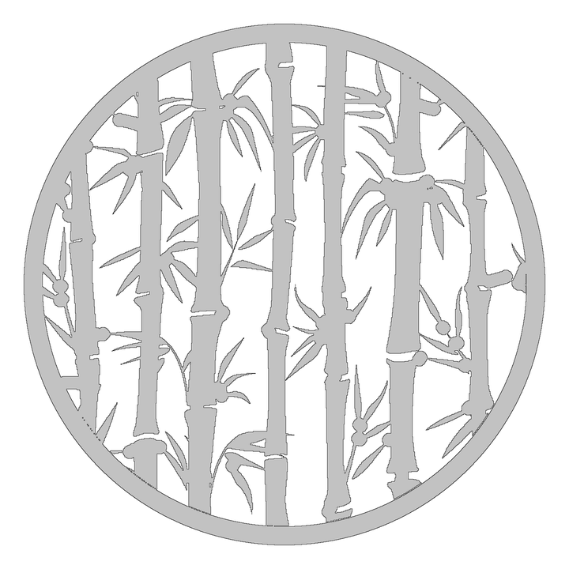

# Gobo Art Handoff for Ben

This document summarizes what Steve and Codex learned while converting artwork
into Fusion-ready, FDM-printable gobos for the Resonance Tree downlights.

The short version: send bold, high-contrast art with recognizable large shapes.
Do not worry about drawing the production ring or manually connecting every
island. The conversion pipeline can crop, reconnect, scale, and boolean-union
the art. However, the source composition strongly affects whether the finished
part is attractive, produces a useful shadow, and survives removal from a sticky
PETG build plate.

## Fixed production interfaces

- Large ring: 55 mm OD / 51 mm ID, used by 14 of the 100 bamboo tube shades.
- Small ring: 50 mm OD / 46 mm ID, expected for most remaining shades.
- Ring wall: 2 mm radial thickness for both sizes.
- Filename suffix: `-55mm` or `-50mm`; `-neg` means the subject is open.
- Sketch origin: center of the circle at `(0,0)`.
- Gray or black in previews: printed plastic that blocks light.
- White in previews: open area that passes light.
- Baseline blocked-area target: 40-45% of the complete disc, including the outer
  ring, for ordinary positive patterns.
- Deliberately denser art is allowed when the visual result warrants it. The
  Bamboo-5a through Bamboo-5c series is approximately 52-54% blocked.

The final production file must be one connected printed solid. It must not
contain loose stencil islands or overlapping profiles that Fusion requires Steve
to trim manually.

## Best source art to send

### Preferred package

When possible, send both:

1. A clean SVG as the geometric source.
2. A PNG as a visual reference showing the intended black/white interpretation.

A clean SVG is the best source because it preserves curves and avoids raster
tracing noise. A high-resolution PNG is preferable when the SVG contains
thousands of trace fragments, clipping masks, duplicate paths, embedded raster
images, or other autogenerated complexity.

### Good SVG characteristics

- Filled black shapes on a white background.
- A simple square or circular viewBox.
- Closed paths rather than open strokes. Convert important strokes to filled
  outlines before sending if practical.
- Smooth curves with a reasonable number of control points.
- No need to add the 55 mm ring; the production pipeline will add it exactly.
- No need to connect every leaf manually, but obvious branch-to-leaf connections
  in the source usually produce more natural repairs.

### Good PNG characteristics

- At least 1000 x 1000 pixels when possible.
- Strong contrast and a plain background.
- Black silhouettes are ideal. Green plant material on white can also work, but
  color separation is less predictable than black/white art.
- Avoid compression artifacts, shadows, textured backgrounds, and watermarks.
- If the source is photographic, favor broad natural stalks and leaves over fine
  hairline stems.

## Composition rules for useful shadows

- Design for a circle even if the source canvas is square. Important features
  should survive a circular crop.
- It is acceptable, and often attractive, for leaf tips or stalk ends to be cut
  by the 51 mm circle.
- Use a mix of large open areas and recognizable blocked shapes. Dense texture
  can turn into an indistinct shadow.
- Preserve the visual clues that identify the subject. For bamboo, the stalk
  joints are more important than retaining every small leaf.
- Keep important motifs away from relying on a single tiny point of contact.
- Fine pointed leaf tips are acceptable away from structural attachment points.
  Global thickening can damage leaf character and should not be used when the
  original stalks are already substantial.
- Very small leaves may be treated as sacrificial. Losing one should not release
  a major stalk or branch.

## Ring attachment rules

- Prefer natural contacts created where the circular crop intersects stalks,
  branches, or leaves.
- Aim for at least five distributed contacts around the ring.
- A square repeating pattern may create many natural contacts and require no
  generated ties. Bamboo-5 has more than 20.
- When ties are required, the current nominal width is 1.4 mm.
- Ties must terminate at the 51 mm ring opening and be boolean-unioned into the
  artwork and ring. Overlapping tie rectangles are not a finished Fusion profile.
- Long isolated radial ties tend to look artificial. Scaling or cropping the art
  to make shorter organic contacts is preferred.

## Internal connectivity and print strength

There are two different standards:

1. CAD connectivity: every printed region belongs to one connected profile.
2. Mechanical robustness: the physical print survives slicing, printing, plate
   removal, handling, and installation.

Bamboo-5a proved that CAD connectivity alone is insufficient. Its 0.8 mm repair
necks made one connected SVG, but PETG plate removal broke several necks and
released complete stalk sections.

Use these current mechanical guidelines:

- Ordinary island or stalk-joint repair: 1.4 mm nominal width.
- Critical stalk joint with a history of failure: 2.0 mm centered tab.
- Keep white notches at the sides of a centered tab when the joint is an
  important visual feature.
- Important stalks should have two load paths when possible. Avoid a tree-shaped
  connection graph where one broken neck releases everything downstream.
- Add a few subtle redundant cross-links between substantial regions, especially
  through the middle of the design.
- Do not rely on a tiny leaf tip as the only support for a large stalk segment.

PETG adhesion is part of the load case. Even a design that prints cleanly can
fail while being peeled from the plate. Source art with broad stalks, multiple
contacts, and short load paths is therefore better than delicate stencil art.

## Fusion-ready SVG requirements

These are handled by the conversion pipeline, but are included so generated art
can be checked correctly:

- SVG width and height declare `55mm`.
- Fusion interprets SVG coordinates at 96 DPI. Production coordinates therefore
  use `96 / 25.4` SVG units per millimeter.
- The centered 55 mm viewBox is approximately:

  `-103.937008 -103.937008 207.874016 207.874016`

- The final file contains one path named `printed-solid` with an even-odd fill.
- The exact 55 mm outer contour is preserved as a true circle.
- Ring, artwork, island bridges, joint tabs, and any ties are boolean-unioned.
- Internal intersection lines must not remain for Steve to trim in Fusion.
- Curves should be smooth but reasonably optimized. The successful examples are
  generally in the hundreds, not tens of thousands, of fitted segments.

## Conversion and validation workflow

1. Inspect the source and confirm which color represents printed plastic.
2. Scale and circle-crop the composition to the 51 mm opening.
3. Remove noise and insignificant source fragments.
4. Find all disconnected printed components.
5. Add short structural bridges, then add redundant load paths for major pieces.
6. Count natural ring contacts and add ties only if necessary.
7. Boolean-union artwork, repairs, ties, and the exact ring.
8. Trace or simplify curves to a Fusion-manageable SVG.
9. Verify dimensions, centered origin, one-path topology, blocked area, contact
   count, and deterministic regeneration.
10. Import into Fusion, extrude, inspect in Bambu Studio, test print, remove from
    the plate, and compare the physical result with the Fusion screenshot.

The print is the final structural test. The SVG preview alone cannot reveal all
plate-removal failures.

## Example catalog

All links below are relative to this directory and render directly on GitHub.

| Example | Source/lesson | Status |
| --- | --- | --- |
| [Tree logo SVG](tree-logo-55mm.svg) / [preview](tree-logo-55mm-preview.png) | First normalized 55/51 mm design; demonstrated scale, centered origin, and natural ring contacts. | Fusion import dimensions confirmed. |
| [Bamboo stencil SVG](bamboo-stencil-55mm.svg) / [preview](bamboo-stencil-55mm-preview.png) | Low-resolution black stencil with many islands; demonstrated automated island repair and short ties. | Fusion-ready SVG and preview. |
| [Bamboo-2 SVG](bamboo-2-55mm.svg) / [preview](bamboo-2-55mm-preview.png) | Wide leaf fan; demonstrated fitting by height and intentionally cropping left/right leaf tips. | Fusion-ready SVG and preview. |
| [Bamboo-3 SVG](bamboo-3-55mm.svg) / [preview](bamboo-3-55mm-preview.png) | Photographic green bamboo; global centerline reinforcement made stems printable but also showed how thickening can blunt leaves. | Visual experiment. |
| [Bamboo-4 SVG](bamboo-4-55mm.svg) / [preview](bamboo-4-55mm-preview.png) | Naturally broad upright stalks; retained pointed leaves and avoided unnecessary lower ties. | Good source-art lesson. |
| [Bamboo-5 SVG](bamboo-5-55mm.svg) / [preview](bamboo-5-55mm-preview.png) | Clean square vector grove, circle-cropped with no generated ring ties and normalized near 45% blocked. | Light-normalized variant. |
| [Bamboo-5a SVG](bamboo-5a-55mm.svg) / [preview](bamboo-5a-55mm-preview.png) | Untouched full-density black silhouettes with 0.8 mm repair necks. | Print failed mechanically; several major stalks broke off during PETG plate removal. |
| [Bamboo-5b SVG](bamboo-5b-55mm.svg) / [preview](bamboo-5b-55mm-preview.png) | Increased repair necks to 1.4 mm and added six redundant links. | Second print was substantially better but lost one center-right stalk section. |
| [Bamboo-5c SVG](bamboo-5c-55mm.svg) / [preview](bamboo-5c-55mm-preview.png) | Added two direct 2.0 mm tabs through the failed stalk's joints while retaining white side notches. | Current latest candidate; third print qualification pending. |
| [Bamboo-5c-neg SVG](bamboo-5c-neg-55mm.svg) / [preview](bamboo-5c-neg-55mm-preview.png) | Internal negative: the ring and former white regions print, while stalks and leaves become openings. Short passages through joints connect the printed negative field. | Experimental plate-release variant; print qualification pending. |
| [Bamboo-6-neg SVG](bamboo-6-neg-55mm.svg) / [preview](bamboo-6-neg-55mm-preview.png) | Direct negative conversion of portrait vector art. White background and ring print; bamboo is open. Fine openings were broadened slightly rather than adding a new canopy. | One connected printed component; approximately 45.7% aperture open; print qualification pending. |
| [Bamboo-7-neg SVG](bamboo-7-neg-55mm.svg) / [preview](bamboo-7-neg-55mm-preview.png) | Clean single-path portrait vector with broad stalks and leaves; required only four background passages and no supplemental leaves. | One connected printed component; approximately 45.3% aperture open; print qualification pending. |
| [Bamboo-2a-neg SVG](bamboo-2a-neg-55mm.svg) / [preview](bamboo-2a-neg-55mm-preview.png) | Adds balanced narrow four-leaf fans near 10 and 2 o'clock, using the separated 5 o'clock leaves as the visual reference. | Aperture-open increased from about 33.9% to 37.0%; no new repair passages; one connected printed component; print qualification pending. |
| [Bamboo-2a-neg 50 mm SVG](bamboo-2a-neg-50mm.svg) / [preview](bamboo-2a-neg-50mm-preview.png) | Exact 50/46 mm refit of the revised thin-leaf Bamboo-2a negative. | 36.8% aperture-open; no mapped contact repairs; one connected printed component. |
| [Bamboo Stencil 2 negative SVG](bamboo-stencil-2-neg-50mm.svg) / [preview](bamboo-stencil-2-neg-50mm-preview.png) | Flat green downloaded stencil converted to [black and white](bamboo-stencil-2-bw.png), enlarged and shifted to retain leaves while cropping the lower-left stem. | 37.0% aperture-open; no repair passages; one connected printed component. |
| [Bamboo-8 negative SVG](bamboo-8-neg-50mm.svg) / [preview](bamboo-8-neg-50mm-preview.png) | Clean segmented vector bamboo; its decorative source circle was removed before the negative conversion so the production ring remains solid. | Exact 50/46 mm; 37.45% aperture-open; no repair passages; one connected printed component. |
| [50/46 mm production family](tree-logo-50mm.svg) | Small-format positives and negatives for Tree Logo and the Bamboo-2, Bamboo-2a, Bamboo-5c, Bamboo-6, Bamboo-7, Bamboo-8, and Bamboo Stencil families. | Eleven 50 mm SVGs and previews; every rendered file verifies as one connected printed component. |

Negative patterns reverse the structural problem. Instead of connecting every
stalk and leaf as printed plastic, the conversion must connect every background
region by opening selected stalk joints and leaf contacts. Report open area both
over the complete disc and within the aperture because the solid ring reduces
the full-disc percentage substantially.

Use `-neg` for negative-pattern filenames.

### Current recommended reference

Use Bamboo-5c as the current structural reference, not because every future image
should look like Bamboo-5c, but because it captures the best current rules:

- natural ring contacts;
- full-density recognizable bamboo;
- visible joint notches;
- 1.4 mm ordinary repairs;
- redundant internal load paths; and
- 2.0 mm targeted tabs on critical stalk joints.

## What Ben should send with each new candidate

- SVG and PNG when both are available.
- A short name or pattern ID.
- Which color should be printed plastic.
- Whether exact small details are important or may be simplified.
- Which identifying features must survive, such as bamboo joints.
- Whether the composition may be rotated, enlarged, or cropped aggressively.
- Whether the design should target the normal 40-45% blocked range or may be
  intentionally denser.

Steve can then return the Fusion-ready SVG plus a preview and, after printing,
physical feedback about what survived the slicer and build-plate removal.
